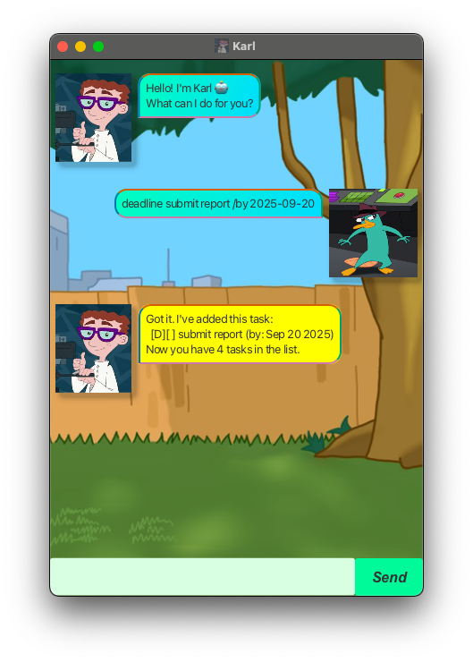
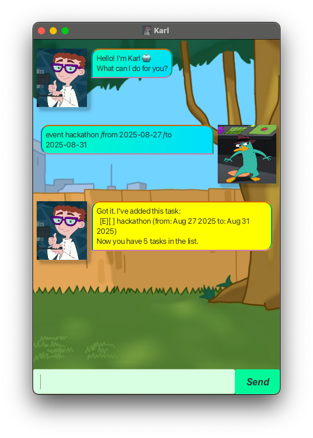
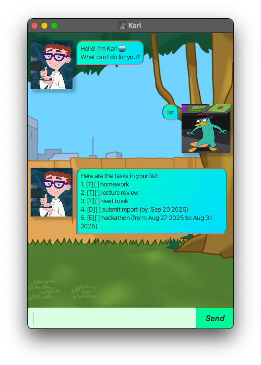
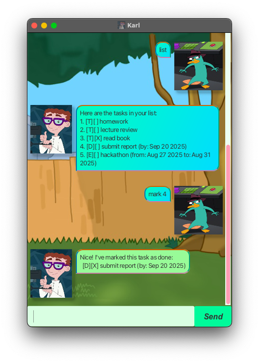
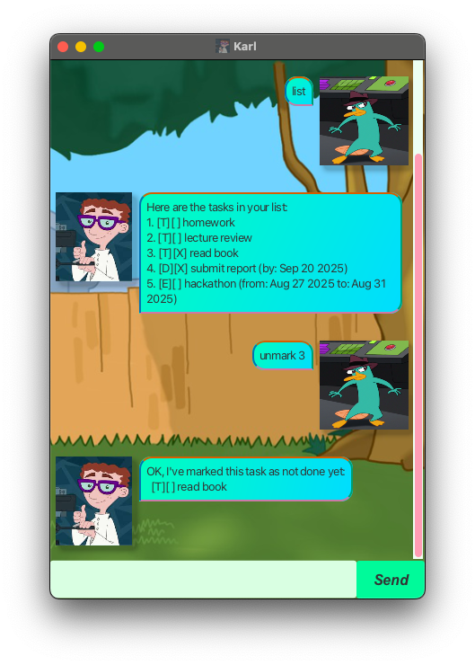
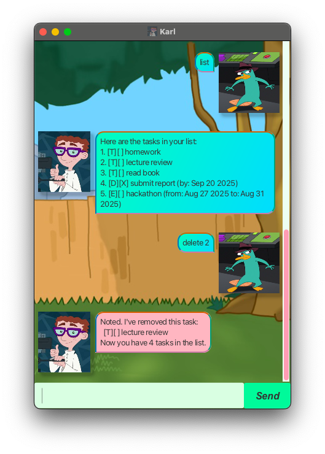
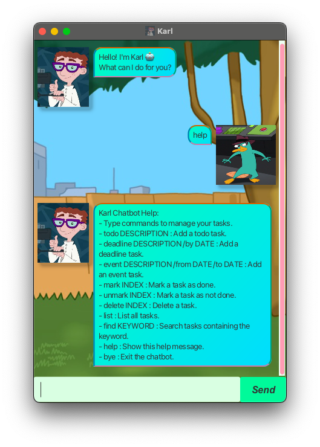

# Karl Chatbot User Guide

Welcome to **Karl 🤖**, your friendly task management chatbot! This guide helps you get started and make the most of Karl’s features.

<p align="center">
    
</p>


---

## Features

### Adding a Todo Task

**Format:**
```
todo TASK_DESCRIPTION
```
**Description:**

Adds a todo task with the given description to your task list. Todo tasks have no deadlines or event times.
**Example:**
```
todo read book
```
---

### Adding a Deadline Task

- **Format:**
```
deadline TASK_DESCRIPTION /by YYYY-MM-DD
```
- **Description:**
Adds a deadline task with the given description and due date.
- **Example:**
```
deadline submit report /by 2025-09-20
```
---

### Adding an Event Task

- **Format:**
```
event TASK_DESCRIPTION /from YYYY-MM-DD /to YYYY-MM-DD
```
- **Description:**
Adds an event task with the given description and scheduled time.
- **Example:**
```
event hackathon /from 2025-08-27 /to 2025-08-31
```
---

### List Tasks

- **Format:**
```
list
```
- **Description:**
Shows all tasks currently in your task list in numbered order.
---

### Marking a Task as Done

- **Format:**
```
mark TASK_NUMBER
```
- **Description:**
Marks the task with the given number as done.
- **Example:**
```
mark 3
```
---

### Unmarking a Task (Mark as Not Done)

- **Format:**
```
unmark TASK_NUMBER
```
- **Description:**
Marks the task with the given number as not done.
- **Example:**
```
unmark 3
```
---

### Deleting a Task

- **Format:**
```
delete TASK_NUMBER
```
- **Description:**
Deletes the task with the given number from your list.
- **Example:**
```
delete 2
```
---

### Finding Tasks by Keyword

- **Format:**
```
find KEYWORD
```
- **Description:**
Lists all tasks containing the keyword in their description.
- **Example:**
```
find book
```
---

### Getting Help

- **Format:**
```
help
```
- **Description:**
Karl will provide you with a help message.
---

### Exiting the App
- **Format:**
```
bye
```
- **Description:**
Exits the Karl chatbot application.
---

## Getting Started

1. Type your command and press Enter.
2. Karl will confirm your action or show results.
3. Manage your tasks efficiently and effortlessly!

---

## Tips

- Always check the command format for deadlines and events (use `/by`, `/from` and `/to`).
- Use the `list` command often to review your tasks.
- Mark tasks done as you complete them to stay organized.

---

Thank you for choosing **Karl 🤖**. Happy task managing!

---
